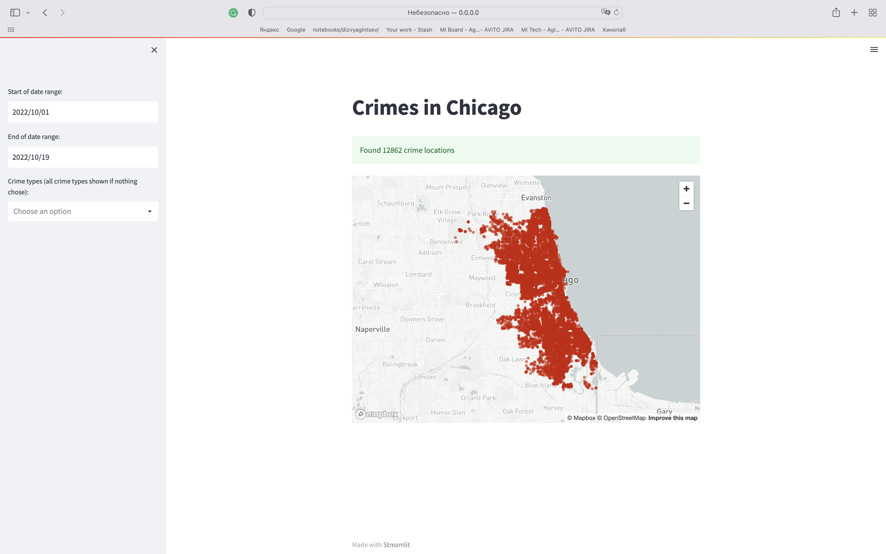

# Chicago crimes map

Dashboard for visualization data from `bigquery-public-data.chicago_crime.crime`. Built with [Streamlit](https://github.com/streamlit/streamlit) and [FastAPI](https://github.com/tiangolo/fastapi).

## How to run
1. Create service user in google cloud console
2. Generate JSON with credentials
3. Put your credentials to api/credentials/credentials.json
4. Run `docker-compose up --build` in the root of repo

Dashboard will be available at http://0.0.0.0:8501 and API at http://0.0.0.0:8000. After deploying an API you can find 
docs at http://0.0.0.0:8000/docs#/

## How to make it better
Here is a list of things that could be improved in this dashboard:

- [ ] Better caching. Now I am using simple st.cache that doesn't work if we change dates interval a bit (for example 
by adding one extra day). We can use more complex caching on API side, store locations grouped by date and type in Redis 
and join data from cache with data from bigquery
- [ ] Better map. `streamlit.map` is too simple. So if in the future we would like to add different markers on map, 
to add pop-ups or build a heatmap we should use another map.
- [ ] OAuth authentication so every client will not use one credentials stored on server
